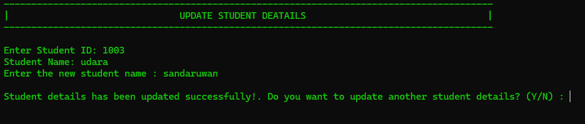

# Mark Management System

## Overview
The **Mark Management System** is a Java-based application designed to manage students' data, including personal details
and marks for Programming Fundamentals and Database Management Systems. This is an assignment of my FMD Diploma programm
it's base on basic java programming logics

## Features
1. **Home Page**
2. Add New Student
3. Add New Student With Marks
4. Add Marks
5. Update Student Details
6. Update Marks
7. Delete Student
8. Print Student Details
9. Print Student Ranks
10. Best in Programming Fundamentals
11. Best in Database Management System

---

## Image Placeholders

### 1. Home Page


### 2. Add New Student


### 3. Add New Student With Marks


### 4. Add Marks


### 5. Update Student Details


### 6. Update Marks


### 7. Delete Student


### 8. Print Student Details


### 9. Print Student Ranks


### 10. Best in Programming Fundamentals


### 11. Best in Database Management System


---

## How to Use
1. Clone the repository:
   ```bash
   git clone https://github.com/yourusername/MarkManagementSystem.git
   
2. Compile the Java program:
    ```bash
    javac MarkManagementSystem.java
   
3. Run the program:
   ```bash 
   java MarkManagementSystem
   
# Contribution
Contributions are welcome! Feel free to open issues or submit pull requests.

# License
This project is licensed under the MIT License. See the LICENSE file for details.